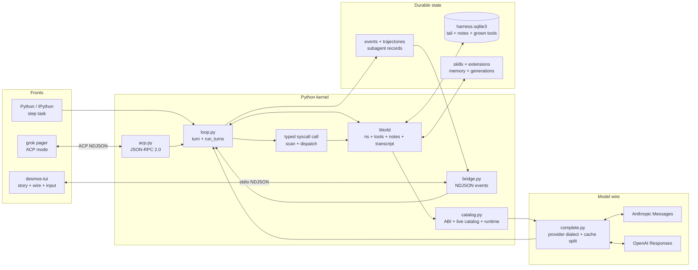
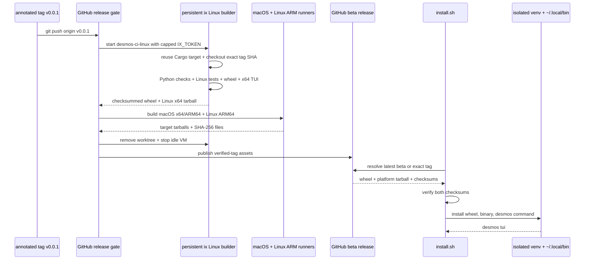
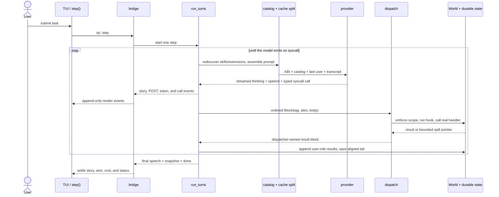
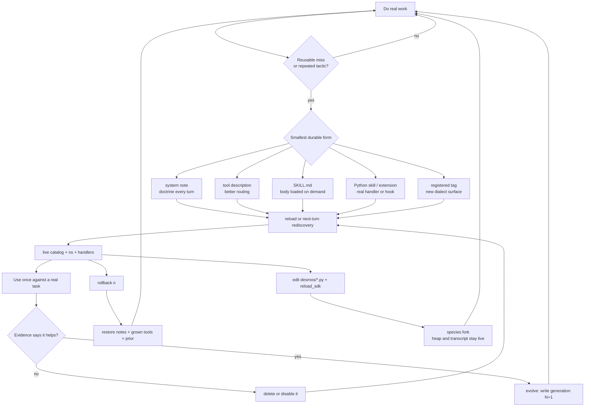

<div align="center">

# desmos

**A coding agent that owns its harness.**

[](https://github.com/umgbhalla/desmos/actions/workflows/release.yml)
[](LICENSE)
[](pyproject.toml)
[](pyproject.toml)

[Design](docs/design.md) · [Tags](docs/tags.md) · [Self-growth](docs/self-growth.md) · [Subagents](docs/subagents.md) · [Contributing](CONTRIBUTING.md)

</div>

---

## The inversion

Most agents own the conversation and call your code. desmos flips it. **You own
a Python kernel; the agent is a function you call from inside it.**

```python
doc = open("paper.txt").read()
step("what's in doc? don't dump it")
step("ok, now list the functions it defines")
```

`doc` never enters the prompt. The model gets an *index* of the kernel — names
and shapes — and a way to run code against them. It fetches what it needs. The
context window ends up holding decisions and results instead of payloads, and
sequential `step` calls share one transcript.

The second half of the idea: **capability is discovered, not compiled in.**
One external syscall tool advertises seven capability families. Earlier tag
names remain accepted as hidden compatibility aliases, while custom tools,
descriptions, notes and skills can still be written by the agent into durable
runtime state. The next `complete()` sees the change. No restart.

## Runtime architecture



Python owns every fact and mutation. Rust paints bridge events, so closing the
TUI does not redefine the kernel's state or syscall history.

## Quickstart

Install the latest beta TUI and Python harness:

```bash
curl -fsSL https://raw.githubusercontent.com/umgbhalla/desmos/main/install.sh | sh
desmos tui
```

Pass a tag to install an exact release:

```bash
curl -fsSL https://raw.githubusercontent.com/umgbhalla/desmos/main/install.sh | sh -s -- v0.0.1
```

Release binaries use the stable raw artifact path
`https://github.com/umgbhalla/desmos/releases/download/<tag>/desmos-tui-<target>.tar.gz`.
Linux and macOS are supported; these early releases are marked beta.



GitHub Actions is the public trigger and publisher. Linux x64 validation runs
inside the stopped-when-idle `desmos-ci-linux` ix VM, so its Cargo target and
toolchains survive between tags; the repository secret is a VM-only ix key
with a `$2` spend cap. Native runners remain for Apple binaries and Linux
ARM64, where a Linux x64 Cargo build is not an equivalent artifact.

For development from a checkout:

```bash
uv venv && uv pip install -e ".[kernel]"
source .venv/bin/activate

export ANTHROPIC_API_KEY=...      # or: python -m desmos auth login   (OpenAI)

python -m desmos check            # self-check, no API key needed
python -m desmos tui              # the full interface (needs cargo)
python -m desmos tui --demo       # same layout, offline, no key
python -m desmos console          # IPython with step() and world bound
python -m desmos run "add a --json flag to inverted.py --check"
```

The harness itself is stdlib-only — `pyproject.toml` says `dependencies = []`.
The `kernel` extra is just IPython. Only the TUI needs Rust.

## The frozen tags

Text the model writes is speech. An XML tag is a syscall.

| tag | what it does |
|---|---|
| `python` | exec in the persistent kernel; names stay |
| `bash` | one-shot subprocess in cwd, no state kept |
| `shell` | named persistent pty: cwd, env, venv and running processes survive |
| `edit` | replace exactly one occurrence (`old` / `---` / `new`) |
| `register` | install a new tag, live on the next dispatch |
| `system` | write or delete a note — doctrine, in every prompt |
| `tool` | rewrite a tool's catalog description |
| `skill` | load a full `SKILL.md` on demand |
| `reload` | rediscover skills and extensions now |
| `reload_sdk` | reimport `desmos.*` and rebind `step` without restarting |
| `evolve` | snapshot grown state as the next generation |
| `rollback` | restore generation `n` |
| `memory` | durable cross-session memory, kept out of the prompt |

Every tag in a reply runs, in order; all results come back together as
user-role `result` blocks on the same transcript. Any tag takes `end="TOKEN"`
so a body can contain tag text safely.

**Full reference with attributes and result shapes: [docs/tags.md](docs/tags.md).**

## How a turn works



Grown tools, notes and the transcript tail live in `.desmos/harness.sqlite3`.
`evolve` snapshots them as a numbered generation; `rollback` restores one. That
pair is what makes self-modification survivable.

**Architecture, dispatch order, persistence and the invariants:
[docs/design.md](docs/design.md).**

## Evolution loop



Speech and heap values are not memory. Notes, skills, registered tools, memory
records, and generation snapshots write to stores that the next turn or process
restart reads. Rollback restores notes, grown tools, and prior turns; it does
not undo files, memory records, or the current transcript.

## The TUI

```
python -m desmos tui
```

Left column, then right:

```
story        the turn: your prompt, speech as markdown, each edit as a
             folded diff card
POST in/out  the last complete() request and reply as a folding JSON tree
queue        follow-ups stacked while a step runs (hidden when empty)
input        the composer

activity     the wire: complete() cards and every syscall with body + result
git          status / branches / log, tabbed
files        the file the git cursor points at, or the filesystem
meta         ctx bar, cache read-vs-write, cost, model/effort/gen, theme
```

`ctrl+p` opens the settings picker (provider, model, effort). `ctrl+g` and
`ctrl+b` toggle the git and file panes. Tab cycles panes, skipping any collapsed
to zero rows; everywhere, up/down moves the cursor and left/right drives that
pane's second axis (fold, tab, directory, order). `?` floats the focused pane's
cheatsheet. `Enter` zooms the selected block into a searchable viewer.

While a step runs, `Enter` queues a follow-up instead of interrupting; an empty
`Enter` is send-now. `[` and `]` reorder the queue.

`--grok` launches grok-build's pager with `python -m desmos acp` on stdio.
`python -m desmos comet` launches the vendored Comet desktop frontend with
desmos registered as an ACP harness — see
[docs/comet-frontend.md](docs/comet-frontend.md).

## Two providers

Anthropic and OpenAI, one transcript, switchable mid-session.

| provider | models | credential |
|---|---|---|
| anthropic | `claude-opus-5`, `claude-sonnet-4-6` | `ANTHROPIC_API_KEY` (environment only) |
| openai | `gpt-5.6-sol`, `-luna`, `-terra` | `python -m desmos auth login` → `~/.desmos/auth.json` |

```bash
python -m desmos auth login             # browser + PKCE to localhost:1455
python -m desmos auth login --device
python -m desmos auth status            # which providers are usable
```

An existing Codex CLI login at `~/.codex/auth.json` is read as-is.

Switching keeps the transcript. Blocks the other provider made survive as plain
text — lossy, never fatal, because a reasoning item is opaque to anything but
the endpoint that produced it. Nothing is compacted or discarded to make a
switch work.

The system prompt adapts to the family it is driving (`desmos/dialect.py`): the
capability half is identical, the working-style half is not. Asking Opus 5 for
brevity shortens its answers; asking GPT-5.6 the same shortens the artifact
instead, so it is not asked.

Both providers fold the transcript **server-side** once it passes the trigger —
Anthropic via `compact_20260112`, OpenAI via Responses `context_management`. The
returned block is opaque, replayed verbatim, and becomes the cut point for
everything before it. desmos never rewrites history locally, so a fold cannot
invalidate the cached prefix.

`ctrl+p` in the TUI saves provider/model/effort to `~/.desmos/settings.json`
(`DESMOS_SETTINGS` moves it); that file outranks whatever the last session
persisted, and a machine without one opens the picker rather than guessing.
`DESMOS_MODEL` picks the model for `desmos run` and `inverted.py`;
`DESMOS_THINKING` is the effort floor (`low`).

## Headless

```bash
python -m desmos run "task"
python inverted.py "task"          # back-compat entry, same defaults
python inverted.py --check
```

Both take the same `--max-tokens`, `--max-turns`, `--max-total-tokens`. Traces
land under `runs/`. State lands in `.desmos/harness.sqlite3` (gitignored). The
chat is append-only inside a session, only its tail is carried across a restart,
and `reset()` clears it outright.

## Skills and extensions

Same grain as [pi](https://github.com/earendil-works/pi) and Prime Agent. The
base ABI stays frozen; capability is discovered.

**Skills** are Agent Skills `SKILL.md` files. The catalog carries name and
description only — `skill name="…"` loads the full body on demand, so a long
procedure costs one line until someone asks for it. Python-backed skills are
imported into the kernel.

```
.desmos/skills/<name>/SKILL.md      project
~/.desmos/skills/<name>/SKILL.md    machine
.agents/skills/  ~/.agents/skills/  shared with other harnesses
```

The `~` roots are shared with every other harness on the box, so a skill dropped
there by something else is one desmos pays for too.

**Extensions** are `load(api)` Python files under `.desmos/extensions/` or
`~/.desmos/extensions/`. They can `api.tool(...)` to add a tag, or
`api.hook("before_dispatch", …)` to inspect or veto one — returning a string
from that hook replaces the result and the call never runs.

See [docs/extensibility.md](docs/extensibility.md) and
[docs/self-growth.md](docs/self-growth.md).

## Subagents

`spawn` returns immediately; `wait`, `gather`, `status` and `result` collect.
A child is an isolated `World` with its own transcript, a scoped tag set, and no
ability to write parent state. Depth is capped at 1.

Pass a `TaskContract` (or the `simple={...}` shorthand) and the parent judges the
child's claims against what it actually observed — `judgment(id)` is the verdict,
`result(id)` is only the child's story about itself. A bare string task skips all
of that and gives you prose you have to take on trust.
[docs/subagents.md](docs/subagents.md).

## Development

```bash
python -m desmos check                     # harness self-check
python -m unittest discover -s tests -q    # unit tests
cargo test -p desmos-tui                   # TUI
cargo test -p xai-grok-markdown -p xai-grok-markdown-core
```

Never `cargo build --workspace`: every vendored grok crate is a member, so that
builds ~89 packages. Always target a package.

Building the TUI needs Rust (`rust-toolchain.toml` pins **1.97.1**) and a
protobuf compiler (`brew install protobuf`, or `protobuf-compiler` on Debian).
`.cargo/config.toml` forces `PROTOC=scripts/protoc`, a wrapper that resolves to
a real absolute path so cargo's `rerun-if-changed` stays stable — a bare PATH
`protoc` makes cargo rebuild the whole pager graph on every launch.
`python -m desmos tui` hashes our sources and reuses `target/release/desmos-tui`
unless they changed, so only the first launch is slow. `vendor/grok-build` is
committed, but a cold build still fetches two git deps; it is not offline.

`DESMOS_ACP` is our branch inside the committed pager, not upstream — a sync
that overwrites it hands `--grok` back to grok's own agent with no compile
error, so `python -m desmos check` asserts it is still there.

Contributions welcome: [CONTRIBUTING.md](CONTRIBUTING.md).
Vulnerabilities: [SECURITY.md](SECURITY.md) — never a public issue.

## Docs

| page | what it covers |
|---|---|
| [design.md](docs/design.md) | architecture, turn loop, dispatch, persistence, invariants |
| [tags.md](docs/tags.md) | every tag, attributes, result shapes |
| [self-growth.md](docs/self-growth.md) | how the agent extends itself |
| [extensibility.md](docs/extensibility.md) | writing an extension |
| [subagents.md](docs/subagents.md) | contracts, fan-out, judgment |
| [comet-frontend.md](docs/comet-frontend.md) | the optional desktop frontend |
| [openai-prompt-cache-audit.md](docs/openai-prompt-cache-audit.md) | measured cache behaviour |

`AGENTS.md` (symlinked as `CLAUDE.md`) is the instruction file for coding agents
run against this repo.

## License

MIT — see [LICENSE](LICENSE). Vendored third-party code under `vendor/` keeps
its own license.
