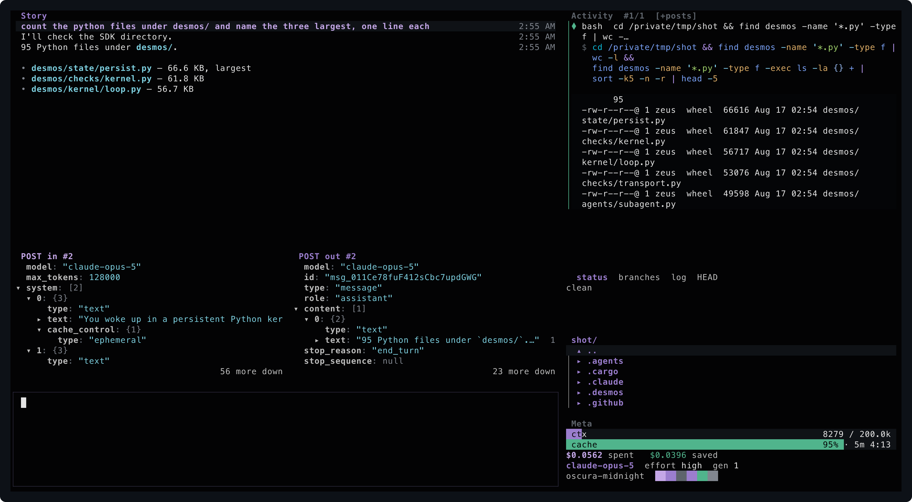
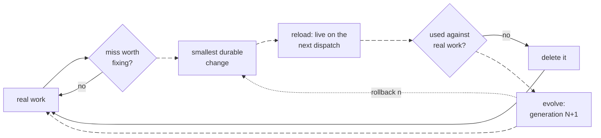
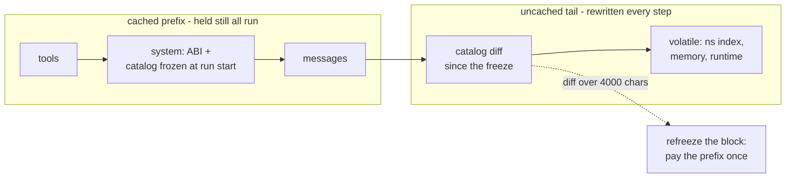
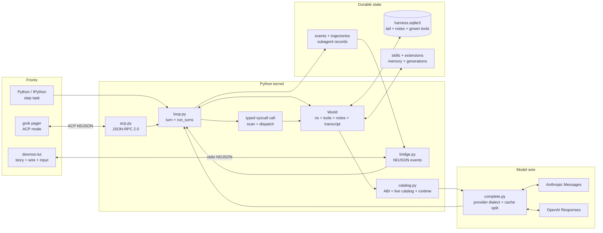
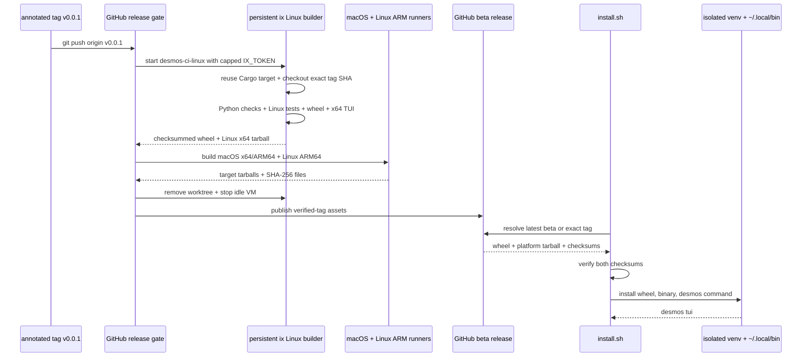
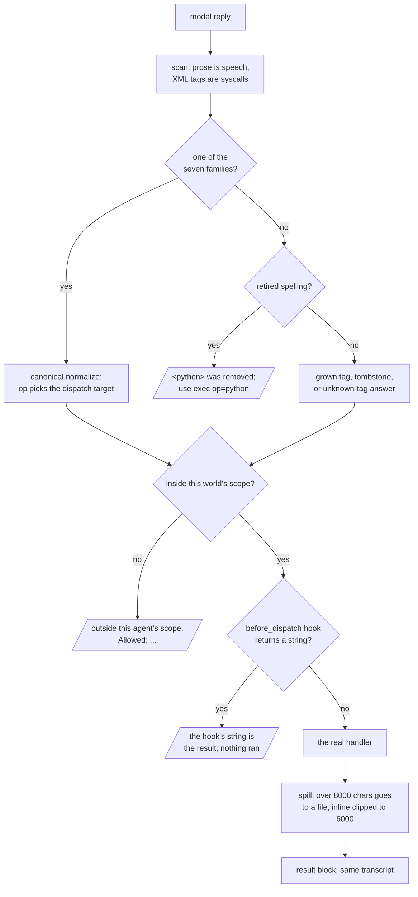
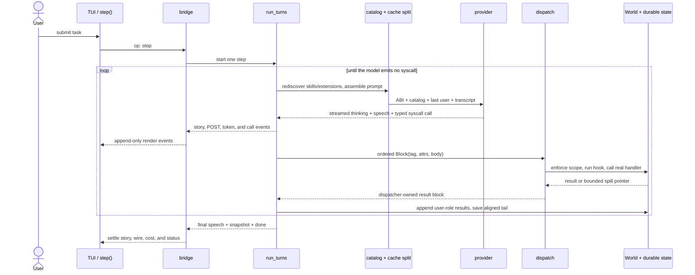
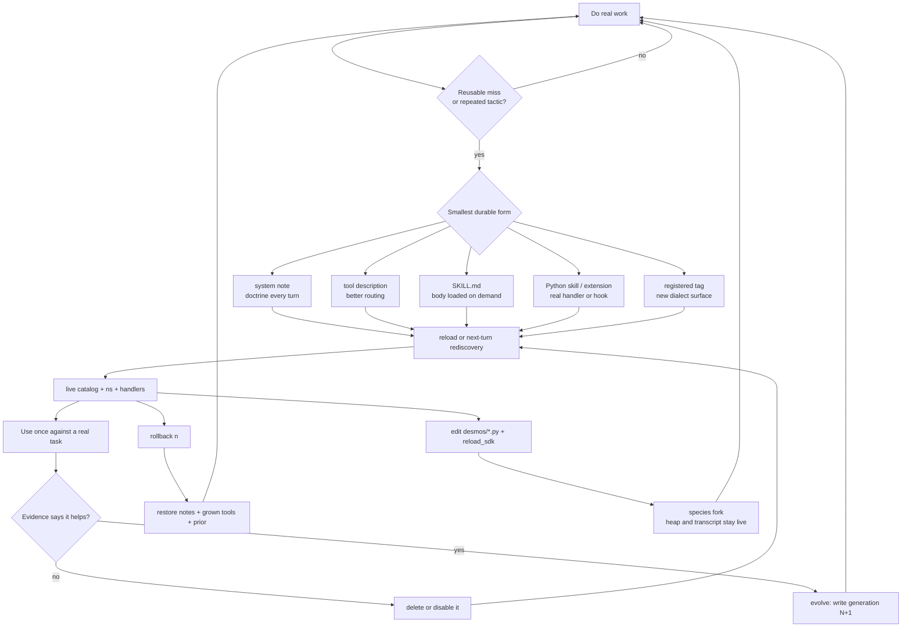
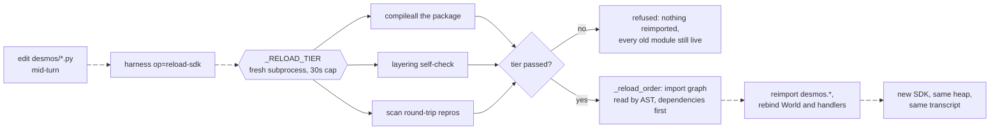
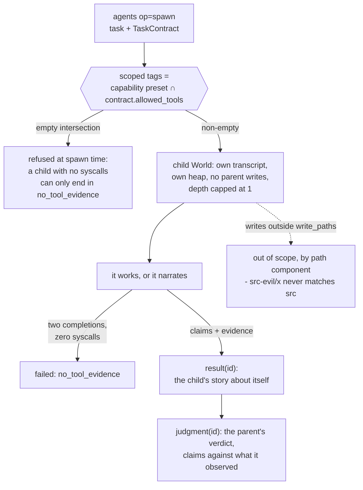

<div align="center">

# desmos

**A coding agent that rebuilds its own harness, live, and keeps every change reversible.**

[](https://github.com/umgbhalla/desmos/actions/workflows/release.yml)
[](LICENSE)
[](pyproject.toml)
[](pyproject.toml)

[Design](docs/design.md) · [Tags](docs/tags.md) · [Self-growth](docs/self-growth.md) · [Constitution](docs/constitution.md) · [Subagents](docs/subagents.md) · [Contributing](CONTRIBUTING.md)



</div>

---

## Recursive self-improvement

Most coding agents are frozen at the moment they ship. Their tools are compiled
in, and whatever they work out during a session dies with the transcript.

desmos treats the agent's own capability surface as writable state. Inside a
turn it can write doctrine, install a syscall, author a skill, or edit the SDK
that is running it — and that change is live on the *next* dispatch, in the same
process, with the heap and the transcript intact.

Self-modification is only worth having if it is survivable, so the loop is
closed at both ends:

| stage | mechanism |
|---|---|
| **change** | notes, tags, skills, extensions and `desmos/*.py` are all writable from inside a turn |
| **live** | `harness op=reload` / `op=reload-sdk` rebind the catalog and handlers — no restart, no lost state |
| **prove** | the new thing is used once against real work, and the evidence decides |
| **keep or drop** | anything that did not earn its line in the catalog is deleted |
| **snapshot** | `op=evolve` writes generation N+1; `op=rollback` restores notes, grown tools and prior turns |



<sub>The moving edges are the loop as it runs: miss, change, live, kept.</sub>

One row of that table is doctrine rather than a gate. Two of the gates are real:
`reload-sdk` refuses a tree that fails the reload tier
([`kernel/loop.py:1452`](desmos/kernel/loop.py)), and a child that claims a
result without ever calling a syscall fails with `no_tool_evidence`
([`agents/subagent.py:706`](desmos/agents/subagent.py)). **prove** is not one of
them: nothing blocks `evolve` on missing evidence, and `evolve(world, reason="")`
takes an optional string ([`state/generations.py:75`](desmos/state/generations.py)).
What the harness guarantees is that every change is reversible and on the record.
Deciding a change earned its line is the operator's half of the loop.

The ceiling is deliberate. A generation is a snapshot a human can read and
revert, the base prompt is not self-writable, and no part of the loop turns
without someone asking for a turn. What compounds here is the harness, not the
model — swap the model tomorrow and the notes, skills and tags it left behind
are still there.

## Why the kernel holds the data

An agent cannot improve on what it cannot afford to look at: its own source, its
own trajectory, a whole repository. desmos does not paste any of it. **You own a
Python kernel; the agent is a function you call from inside it.**

```python
doc = open("paper.txt").read()
step("what's in doc? don't dump it")
step("ok, now list the functions it defines")
```

`doc` never enters the prompt. The model gets an *index* of the kernel — names
and shapes — and a way to run code against them. It fetches what it needs. The
context window ends up holding decisions and results instead of payloads, and
sequential `step` calls share one transcript.

The same property is what lets capability be discovered instead of compiled in.
One external syscall tool advertises seven families, and the catalog behind them
is state the agent writes; the next `complete()` sees the change.

### A writable catalog inside a cached prefix

A catalog the agent rewrites mid-run is a cache problem. The prefix runs tools,
then system, then messages, so one byte moved inside the catalog block
invalidates every token behind it. So the block is frozen as first sent this
run, and the change ships as a unified diff in the uncached tail
([`kernel/catalog.py:274`](desmos/kernel/catalog.py)).



A few hundred tokens at the tail instead of the whole prefix, until the
difference stops being cheaper than the truth.

## Runtime architecture



Python owns every fact and mutation. Rust paints bridge events, so closing the
TUI does not redefine the kernel's state or syscall history.

## Quickstart

Install the latest beta TUI and Python harness:

```bash
curl -fsSL https://raw.githubusercontent.com/umgbhalla/desmos/main/install.sh | sh
desmos tui
```

Pass a tag to install an exact release:

```bash
curl -fsSL https://raw.githubusercontent.com/umgbhalla/desmos/main/install.sh | sh -s -- v0.0.1
```

Release binaries use the stable raw artifact path
`https://github.com/umgbhalla/desmos/releases/download/<tag>/desmos-tui-<target>.tar.gz`.
Linux and macOS are supported; these early releases are marked beta.



GitHub Actions is the public trigger and publisher. Linux x64 validation runs
inside the stopped-when-idle `desmos-ci-linux` ix VM, so its Cargo target and
toolchains survive between tags; the repository secret is a VM-only ix key
with a `$2` spend cap. Native runners remain for Apple binaries and Linux
ARM64, where a Linux x64 Cargo build is not an equivalent artifact.

For development from a checkout:

```bash
git submodule update --init vendor/grok-build
uv venv && uv pip install -e ".[kernel]"
source .venv/bin/activate

export ANTHROPIC_API_KEY=...      # or: python -m desmos auth login   (OpenAI)

python -m desmos check            # self-check, no API key needed
python -m desmos tui              # the full interface (needs cargo)
python -m desmos tui --demo       # same layout, offline, no key
python -m desmos mock --reply "hello"   # local Anthropic SSE; set ANTHROPIC_BASE_URL
python -m desmos console          # IPython with step() and world bound
python -m desmos run "add a --json flag to desmos check, with a test"
```

The harness itself is stdlib-only — `pyproject.toml` says `dependencies = []`.
The `kernel` extra is just IPython. Only the TUI needs Rust.

## The seven families

Text the model writes is speech. An XML tag is a syscall. There is one external
tool and it advertises seven capability families; every call names an `op`.

| family | ops | what it reaches |
|---|---|---|
| `exec` | `python` `bash` `shell` | the persistent kernel, a hermetic one-shot, a named PTY that keeps cwd, env and running processes |
| `workspace` | `find` `read` `edit` `see` `commit` | fff search, bounded reads, single-occurrence edits, screenshots, git |
| `knowledge` | `memory` `recall` `system` `todo` | durable facts, prior-session history, always-present doctrine, work items |
| `harness` | `register` `describe` `skill` `reload` `reload-sdk` `evolve` `rollback` | the self-extension lifecycle |
| `observe` | `usage` `trajectory` `retrace` `error` `symbol` `threads` | bounded telemetry and self-diagnosis |
| `agents` | `spawn` `fanout` `resume` `lineage` `status` `result` `judgment` `wait` | child worlds under contract |
| `session` | `compact` `status` `switch` `peers` `inbox` `post` | conversation, model and peer-session lifecycle |

`harness` is the family that closes the improvement loop: `register` installs a
tag that is live on the very next dispatch, `skill` loads a procedure only when
it is wanted, `evolve` snapshots grown state as a numbered generation, and
`rollback` takes it back.

Every call in a reply runs, in written order, and all results come back together
as user-role result blocks on the same transcript. Any call takes `end="TOKEN"`
so a body can safely contain tag text. Legacy single-purpose tag names are
retired, not aliased: `<python>`, `<edit>`, `<register>` and the rest no longer
dispatch. A retired spelling is answered with its canonical replacement, from
the one map both sides read (`REMOVED_TAGS` in
[`kernel/const.py:12`](desmos/kernel/const.py), refused in
[`kernel/dispatch.py:160`](desmos/kernel/dispatch.py)) - rejection, never
silence and never a traceback.

### What one call goes through



Every exit on the left is prose the model can act on. A denied tag is refused
before third-party hooks see it, and a tag that was never real gets the
unknown-tag answer instead, because telling a child that `<grep>` is "withheld"
teaches it the tag exists.

**Full reference with attributes and result shapes: [docs/tags.md](docs/tags.md).**

## How a turn works



Grown tools, notes and the transcript tail live in `.desmos/harness.sqlite3`.
`evolve` snapshots them as a numbered generation; `rollback` restores one. That
pair is what makes self-modification survivable.

**Architecture, dispatch order, persistence and the invariants:
[docs/design.md](docs/design.md).**

## The growth ladder

The loop above in full: five durable forms, ordered by how much they can
break, and the two exits — delete it, or snapshot it as a generation.



### The species fork, and the gate in front of it

Editing `desmos/*.py` from inside a turn is the top of the ladder: it changes
the SDK running the turn that is writing it. The gate that judges the edit runs
in a fresh subprocess, and its source lives in a string constant, so an edit
that broke the tree cannot also have broken its judge
([`kernel/loop.py:1452`](desmos/kernel/loop.py)).



The gate is a fitness check, not the test suite: it costs about a second, and it
catches a tree that will not import, not a loop that compiles and is wrong. The
reload order is derived, not hand-kept - a hand list fell behind twice, so the
graph is parsed instead.

Speech and heap values are not memory. Notes, skills, registered tools, memory
records, and generation snapshots write to stores that the next turn or process
restart reads. Rollback restores notes, grown tools, and prior turns; it does
not undo files, memory records, or the current transcript.

## The TUI

```
python -m desmos tui
```

Pictured above. Left column, then right:

```
story        the turn: your prompt, speech as markdown, each edit as a
             folded diff card
POST in/out  the last complete() request and reply as a folding JSON tree
queue        follow-ups stacked while a step runs (hidden when empty)
input        the composer

activity     the wire: complete() cards and every syscall with body + result
git          status / branches / log, tabbed
files        the file the git cursor points at, or the filesystem
meta         ctx bar, cache read-vs-write, cost, model/effort/gen, theme
```

`ctrl+p` opens the settings picker (provider, model, effort). `ctrl+g` and
`ctrl+b` toggle the git and file panes. Tab cycles panes, skipping any collapsed
to zero rows; everywhere, up/down moves the cursor and left/right drives that
pane's second axis (fold, tab, directory, order). `?` floats the focused pane's
cheatsheet. `Enter` zooms the selected block into a searchable viewer.

While a step runs, `Enter` queues a follow-up instead of interrupting; an empty
`Enter` is send-now. `[` and `]` reorder the queue.

`--grok` launches grok-build's pager with `python -m desmos acp` on stdio.
`python -m desmos comet` launches the vendored Comet desktop frontend with
desmos registered as an ACP harness — see
[docs/comet-frontend.md](docs/comet-frontend.md). `python -m desmos gpuix`
loads published `@gpuix/react` `<markdown>` / `<diff wordDiff>` over the
same ACP server — see [docs/gpuix-frontend.md](docs/gpuix-frontend.md).

## Two providers

Anthropic and OpenAI, one transcript, switchable mid-session.

| provider | models | credential |
|---|---|---|
| anthropic | `claude-opus-5`, `claude-sonnet-4-6` | `ANTHROPIC_API_KEY` (environment only) |
| openai | `gpt-5.6-sol`, `-luna`, `-terra` | `python -m desmos auth login` → `~/.desmos/auth.json` |

```bash
python -m desmos auth login             # browser + PKCE to localhost:1455
python -m desmos auth login --device
python -m desmos auth status            # which providers are usable
```

An existing Codex CLI login at `~/.codex/auth.json` is read as-is.

Switching keeps the transcript. Blocks the other provider made survive as plain
text — lossy, never fatal, because a reasoning item is opaque to anything but
the endpoint that produced it. Nothing is compacted or discarded to make a
switch work.

The system prompt adapts to the family it is driving (`desmos/dialect.py`): the
capability half is identical, the working-style half is not. Asking Opus 5 for
brevity shortens its answers; asking GPT-5.6 the same shortens the artifact
instead, so it is not asked.

Both providers fold the transcript **server-side** once it passes the trigger —
Anthropic via `compact_20260112`, OpenAI via Responses `context_management`. The
returned block is opaque, replayed verbatim, and becomes the cut point for
everything before it. desmos never rewrites history locally, so a fold cannot
invalidate the cached prefix.

`ctrl+p` in the TUI saves provider/model/effort to `~/.desmos/settings.json`
(`DESMOS_SETTINGS` moves it); that file outranks whatever the last session
persisted, and a machine without one opens the picker rather than guessing.
`DESMOS_MODEL` picks the model for headless runs;
`DESMOS_THINKING` is the effort floor (`low`).

## Headless

```bash
python -m desmos run "task"
python -m desmos check
```

It takes `--max-tokens`, `--max-turns`, `--max-total-tokens`. Traces
land under `runs/`. State lands in `.desmos/harness.sqlite3` (gitignored). The
chat is append-only inside a session, only its tail is carried across a restart,
and `reset()` clears it outright.

`inverted.py` at the repo root is a back-compat alias for `desmos run`, kept so
older scripts keep working; it is not the entry point to learn.

## Skills and extensions

Same grain as [pi](https://github.com/earendil-works/pi) and Prime Agent. The
base ABI stays frozen; capability is discovered.

**Skills** are Agent Skills `SKILL.md` files. The catalog carries name and
description only — `skill name="…"` loads the full body on demand, so a long
procedure costs one line until someone asks for it. Python-backed skills are
imported into the kernel.

```
.desmos/skills/<name>/SKILL.md      project
~/.desmos/skills/<name>/SKILL.md    machine
.agents/skills/  ~/.agents/skills/  shared with other harnesses
```

The `~` roots are shared with every other harness on the box, so a skill dropped
there by something else is one desmos pays for too.

**Extensions** are `load(api)` Python files under `.desmos/extensions/` or
`~/.desmos/extensions/`. They can `api.tool(...)` to add a tag, or
`api.hook("before_dispatch", …)` to inspect or veto one — returning a string
from that hook replaces the result and the call never runs.

See [docs/extensibility.md](docs/extensibility.md) and
[docs/self-growth.md](docs/self-growth.md).

## Subagents

`spawn` returns immediately; `wait`, `gather`, `status` and `result` collect.
A child is an isolated `World` with its own transcript, a scoped tag set, and no
ability to write parent state. Depth is capped at 1.

Pass a `TaskContract` (or the `simple={...}` shorthand) and the parent judges the
child's claims against what it actually observed — `judgment(id)` is the verdict,
`result(id)` is only the child's story about itself. A bare string task skips all
of that and gives you prose you have to take on trust.



[docs/subagents.md](docs/subagents.md).

## Development

```bash
python -m desmos check                     # harness self-check
python -m unittest discover -s tests -q    # unit tests
cargo test -p desmos-tui                   # TUI
cargo test -p xai-grok-markdown -p xai-grok-markdown-core
```

Never `cargo build --workspace`: every vendored grok crate is a member, so that
builds ~89 packages. Always target a package.

Building the TUI needs Rust (`rust-toolchain.toml` pins **1.97.1**) and a
protobuf compiler (`brew install protobuf`, or `protobuf-compiler` on Debian).
`.cargo/config.toml` forces `PROTOC=scripts/protoc`, a wrapper that resolves to
a real absolute path so cargo's `rerun-if-changed` stays stable — a bare PATH
`protoc` makes cargo rebuild the whole pager graph on every launch.
`python -m desmos tui` hashes our sources and reuses `target/release/desmos-tui`
unless they changed, so only the first launch is slow. `vendor/grok-build` is a
pinned submodule; source builds must initialize it first. A cold build still
fetches two git deps, so it is not offline.

`DESMOS_ACP` is our branch inside the pinned pager fork, not upstream. Moving
the gitlink to a commit without it hands `--grok` back to grok's own agent with
no compile error, so `python -m desmos check` asserts it is still there.

Contributions welcome: [CONTRIBUTING.md](CONTRIBUTING.md).
Vulnerabilities: [SECURITY.md](SECURITY.md) — never a public issue.

## Docs

| page | what it covers |
|---|---|
| [design.md](docs/design.md) | architecture, turn loop, dispatch, persistence, invariants |
| [tags.md](docs/tags.md) | every tag, attributes, result shapes |
| [self-growth.md](docs/self-growth.md) | how the agent extends itself |
| [constitution.md](docs/constitution.md) | the invariants self-improvement is not allowed to break |
| [identity.md](docs/identity.md) | what state survives which reset |
| [extensibility.md](docs/extensibility.md) | writing an extension |
| [subagents.md](docs/subagents.md) | contracts, fan-out, judgment |
| [comet-frontend.md](docs/comet-frontend.md) | the optional desktop frontend |
| [openai-prompt-cache-audit.md](docs/openai-prompt-cache-audit.md) | measured cache behaviour |

`AGENTS.md` (symlinked as `CLAUDE.md`) is the instruction file for coding agents
run against this repo.

## License

MIT — see [LICENSE](LICENSE). Vendored third-party code under `vendor/` keeps
its own license.
