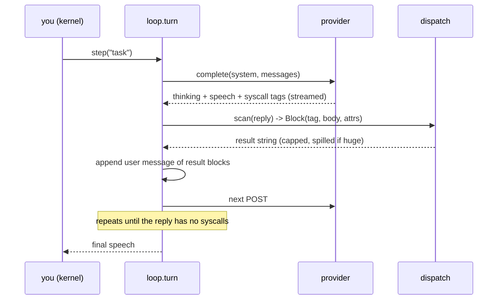
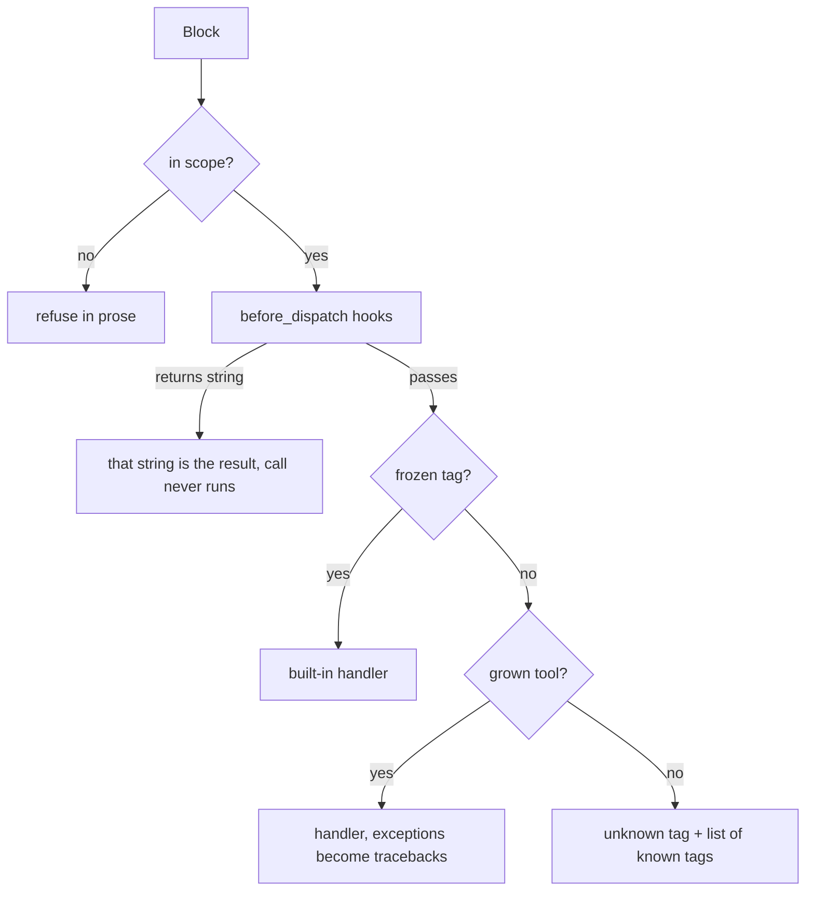

# Design

How desmos is put together, and which parts are allowed to change.

## What the design is for

desmos exists so the agent can improve the harness it runs inside, and so that
improvement stays reversible. Two choices carry that weight.

**The kernel holds the data.** You own a Python kernel; the agent is a function
you call from inside it.

```python
doc = open("paper.txt").read()      # your data, your process
step("what's in doc? don't dump it")
```

The model never receives `doc`. It receives an *index* of the kernel — names and
shapes — and a way to run code against them. Everything it wants, it fetches.
That single choice explains most of the rest of the design: the context window
holds decisions and results, not payloads — which is what makes it affordable
for the agent to read its own source, its own trajectory, and a whole repo.

**Capability is discovered, not compiled in.** Seven canonical XML families are
advertised through one external syscall tool. Legacy names remain accepted but
hidden; every custom tool, note, skill and description can be written by the
agent into state that outlives the process, and takes effect on the next
dispatch. `evolve` and `rollback` bound that: grown state is snapshotted as a
numbered generation, and a generation can be restored.

## The turn



`turn()` is one request plus the dispatch of every syscall in its reply.
`run_turns()` repeats turns until the model stops calling syscalls, the user
stops it, or a token ceiling is hit. There is no turn cap unless you pass one.

Every syscall in a reply runs, in written order, and all of their results come
back in a single user message. A failure does not stop the calls after it — so a
call that depends on an earlier result belongs in the next turn.

## Layers

The point of the architecture is that almost nothing lives in the frozen layer.

| layer | lives in | changed by | cost per turn |
|---|---|---|---|
| canonical ABI | `desmos/kernel/const.py` (`CANONICAL`) | a commit | seven lines in the prompt |
| accepted aliases | same (`COMPAT_ALIASES`) | compatibility-only | hidden |
| grown tools | `.desmos/harness.sqlite3` | harness `op=register` | one catalog line each |
| notes | same | knowledge `op=system` | full text, every turn |
| skills | `SKILL.md` files on disk | a file write, then harness `op=reload` | name + description only |
| extensions | `.desmos/extensions/*.py` | a file write, then harness `op=reload` | whatever they register |
| memory | `.desmos/MEMORY.md` + index | knowledge `op=memory` | a short routing summary |

Grown tools and notes are per-machine state, not repo content. A fresh clone
advertises the same seven families. Legacy names and old grown operations can
still execute for transcript and generation compatibility but do not consume
catalog lines.

The price of a tool is one catalog line in **every** request from then on. That
is the whole cost model, and it is why "write a skill" (name + description only,
body loaded on demand) is the default answer for anything long.

## World

`desmos/types.py` holds one dataclass that is the entire mutable universe:

```
World
  ns          the kernel namespace — your variables
  tools       name -> Tool(doc, source, handler, frozen)
  notes       name -> doctrine text, injected every turn
  skills      discovered SKILL.md descriptors
  hooks       before_dispatch, from extensions
  messages    the transcript, append-only within a session
  shells      live pty sessions, process-lifetime only
  model       provider is inferred from the model name
  generation  monotonic; evolve snapshots, rollback restores
  state_path  None for subagents: they cannot write parent state
```

Two flags matter more than they look. `running` refuses a nested `step()` from
inside a turn — a nested run would append its exchange before the outer
assistant message and permanently corrupt causality. `state_path=None` is how a
child world is denied the parent's persistence, notes and generations.

## Prompt assembly

`catalog.system_prompt(world)` builds one string, in this order:

1. **ABI** (`const.ABI`) — the frozen tag syntax and the rules of the medium.
2. **catalog** — every tool as `<name> doc`, frozen ones first.
3. **notes** — the agent's own doctrine, verbatim.
4. **skills** — name and description only, in `<available_skills>`.
5. **memory** — a short routing summary; details stay tool-retrievable.
6. **runtime** — cwd, generation, model, state paths, TUI semantics: the facts
   the agent needs to unstick itself without asking.
7. **dialect** (`desmos/dialect.py`) — capability prose plus the working style
   the driving model family actually responds to.

The dialect split is deliberate: the capability half is identical across
providers, the working-style half is not. Asking Opus 5 for brevity shortens the
answer; asking GPT-5.6 the same shortens the artifact, so it is not asked.

`complete.split_system()` cuts this into a stable prefix and a volatile tail so
the prefix stays cacheable across a whole session.

## How a syscall arrives

Both wires hand the harness a typed call, not prose to parse.

| | OpenAI Responses | Anthropic Messages |
| --- | --- | --- |
| call block | `custom_tool_call` | `tool_use` |
| id field | `call_id` | `id` |
| body | raw text (freeform custom tool) | `input.input`, a JSON string |
| answer | `custom_tool_call_output` | `tool_result` |

`loop.syscall_call()` accepts either and `loop.syscall_body()` unwraps it, so
the rest of the turn is wire-agnostic. Anthropic has no freeform custom tool, so
its body is JSON-escaped — the same bytes, more of them. The trade is worth it:
when tags were parsed back out of assistant prose the model could keep writing
past its own call and answer it itself, and the story pane painted raw XML
whenever the stripper and the scanner disagreed about where a body ended.

A reply that carries no call but does contain scannable XML ends the turn with
an error rather than running it. `scan()` already ignores tags inside fences and
code spans, so writing *about* a tag is safe; writing one loose is not.

Unpaired blocks are a hard 400 on both wires and poison every later request, so
each payload builder repairs them: a result whose call was folded away degrades
to text, and a call nothing answered gets a stand-in output.

`DESMOS_TOOL_SYSCALLS=0` puts the Anthropic side back on prose parsing. It
exists so a session that cannot issue a call has a way back in.

## Dispatch

`scan()` finds syscalls in a reply. It is not an XML parser — it deliberately
ignores tags inside fenced blocks, indented blocks, inline code spans and
unterminated strings, because the model writes about tags as often as it calls
them. A body ends at the first matching closer, which is why `end="TOKEN"`
exists: `<python end="X">` runs to `</python:X>` and a bare closer inside is
ordinary text.

`dispatch()` then walks a fixed order:



Three properties are load-bearing:

- **Nothing raises out of dispatch.** A bad tag, a denied tag, a handler that
  throws — all become a result string the model can read and retry from. An
  exception here would end the turn instead of teaching it.
- **Scope is enforced before hooks and before the handler.** A subagent's tag
  set is a real capability boundary, not advice.
- **Results are capped, never truncated silently.** `spill()` writes anything
  over the cap to `.desmos/out/NNNN-<tag>.txt` and returns a pointer line, so
  the output still exists — it just is not spent on the context window.

## Transcript

Syscall output comes back as a **user-role** message of `<result tag="...">`
blocks, on the same transcript (the Pi shape). There is no separate tool-result
channel to keep in sync, and the model reads its own output in the same medium
it wrote the call in.

The transcript is append-only within a session. Nothing already sent is
rewritten or reordered. Three exceptions, all explicit:

- a process restart carries only the tail that `persist` kept;
- `reset()` drops the chat outright so a poisoned turn cannot train the next one;
- **compaction is server-side.** Past the trigger the provider folds earlier
  turns and returns an opaque block, which is replayed verbatim and becomes the
  cut point for everything before it. desmos never rewrites history locally, so
  a fold cannot invalidate the cached prefix.

## Persistence and generations

State lives in `.desmos/harness.sqlite3` (gitignored, schema-migrated in
`persist.py`): grown tools with their source, notes, prior steps, and a
turn-aligned tail of the transcript. `turn_aligned()` exists because a naive cut
can orphan a syscall from its result — results are user-role, so "cut at the
next user message" is wrong.

`<evolve>` snapshots the grown state as generation N+1 under
`.desmos/generations/`. `<rollback n="1">` restores one. Together they make
self-modification survivable: the agent can rewrite its own tools knowing there
is a way back.

## Providers

```
anthropic   claude-opus-5, claude-sonnet-4-6      ANTHROPIC_API_KEY (env only)
openai      gpt-5.6-sol, -luna, -terra            PKCE login -> ~/.desmos/auth.json
```

One transcript, switchable mid-session with `switch("model", "effort")`. The
switch is validated against available credentials and takes effect on the *next*
request. Blocks the other provider produced survive as plain text — a reasoning
item is opaque to anything but the endpoint that made it — so a switch is lossy
but never fatal, and nothing is discarded to make it work.

Thinking is one dial with two shapes: adaptive effort on Opus 5 and GPT-5.6, a
token budget plus interleaved thinking on older Claude 4. Thinking and redacted
blocks are replayed on the wire, never restated as speech.

## Subagents

`spawn()` builds a child `World` with its own transcript, its own scoped tag
set, and `state_path=None`. Depth is capped at 1 — children cannot spawn
children. Roles differ in model and capability: `explore` is read-only recon,
`general` can edit, `review` judges.

A string task returns prose you have to take on trust. A `TaskContract` (or the
`simple={...}` shorthand) declares objective, allowed paths, write paths,
required evidence and acceptance checks — and the parent then **judges the claim
against what it observed at runtime**, so a child cannot pass by asserting that
it passed. `judgment(id)` is the harness's verdict; `result(id)` is only the
child's story about itself.

## Surfaces

Every surface drives the same `run_turns` over the same `World`.

| surface | command | notes |
|---|---|---|
| console | `python -m desmos console` | IPython with `step` and `world` bound |
| TUI | `python -m desmos tui` | Rust, panes over a JSONL bridge |
| headless | `python -m desmos run "task"` | one-shot, traces to `runs/` |
| ACP | `python -m desmos acp` | NDJSON JSON-RPC for external frontends |
| Jupyter | `python -m desmos kernel` | installs a kernelspec |
| self-check | `python -m desmos check` | no API key needed |

`bridge.py` speaks JSONL to the Rust TUI: the loop emits events (`post`,
`thinking`, `speech`, `result`, `complete`, `compacted`, `turn`, `done`,
`error`, `stopped`, `pending`, `guidance`, `resumed`) and the TUI paints them as
they arrive. A turn is not one paint at the end.

The Story pane and the Activity pane never disagree about what a syscall is,
because a `result` event is never delivered to Story at all. Disjoint routes,
not a shared feed with a filter — a filter has to be right at every call site,
and routes cannot leak by construction.

## Invariants

Things that must stay true. Most bugs worth the name were one of these breaking.

1. Canonical family names and operation meanings do not change. Accepted legacy
   aliases may grow for compatibility, but never reappear in the advertised catalog.
2. The harness imports stdlib only. `dependencies = []`.
3. Dispatch returns a string for every input, including hostile ones.
4. A syscall body ends at its first closer; `end=` is the only escape.
5. The transcript is append-only within a session.
6. A subagent cannot write parent state.
7. Anything over the result cap spills to a file rather than vanishing.
8. Speech and the wire are separate routes, not one route with a filter.

## Map

```
desmos/
  const.py       ABI text, FROZEN set, caps, defaults
  types.py       Block, Tool, World
  catalog.py     system prompt assembly, ns index, runtime block
  dialect.py     per-model-family working style
  scan.py        syscall parser (code-aware), clipping
  dispatch.py    scope -> hooks -> frozen chain -> grown tool
  loop.py        turn, run_turns, step binding, reload, reload_sdk
  complete.py    Anthropic transport, streaming, cache, compaction
  openai.py      OpenAI Responses transport
  exec.py        python/bash execution
  shell.py       persistent pty sessions with a monitor
  persist.py     sqlite state, turn-aligned transcript tail
  generations.py evolve / rollback
  subagent*.py   child worlds, contracts, judgment, the agents tag
  skills/        built-in skills (edit, skill-creator, ...)
  bridge.py      JSONL events for the TUI
  acp.py         ACP stdio server
  check.py       self-check suite
crates/desmos-tui/   the Rust TUI
vendor/grok-build/   committed upstream pager crates (third-party license)
```

## Further reading

- [tags.md](tags.md) — every tag, its attributes, and its result shape
- [self-growth.md](self-growth.md) — how the agent extends itself
- [extensibility.md](extensibility.md) — writing an extension
- [subagents.md](subagents.md) — contracts, fan-out, judgment
- [comet-frontend.md](comet-frontend.md) — the optional desktop frontend
