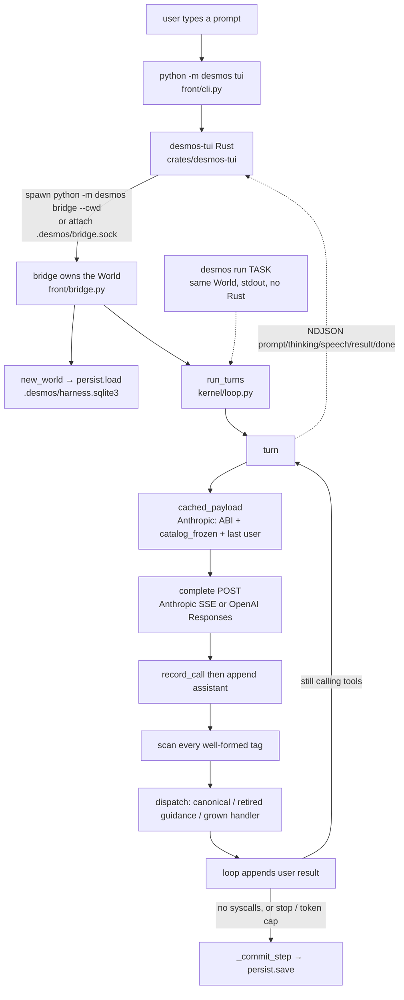

# How Desmos actually works

A runtime briefing for someone who already read `docs/design.md` and wants
the tree, not the pitch. Inventory of what survives which reset is
[identity.md](identity.md). This file is one request through the loop, then
a verdict on leftover complexity.

Read against `main`. Function names here are the contract. Line numbers are
not.

## Punchline

Desmos is a coding agent whose Python process owns the loop. The model is a
gland. A request is a prompt string into `run_turns(world, prompt)` in
`desmos/kernel/loop.py`. That function POSTs the transcript to Anthropic or
OpenAI, scans the reply for XML tags, runs the ones that are syscalls, appends
the outputs as a user-role `<result>` message, and repeats until the model
stops calling tools, the user stops it, or a token ceiling hits.

Durable state lives in `cwd/.desmos/harness.sqlite3` (schema v16) plus mixed
sidecars: JSONL for memory, plans, and decisions; JSON for trajectory; SQLite
for wire events. There is no job object and no local control-plane HTTP API.
OAuth still binds a one-shot `HTTPServer` on `127.0.0.1` in `transport/auth.py`.

The README's reversible-SDK story is narrower than the copy. `reload_sdk` is
a real in-process reimport (it skips `agents.pending`, `front.bridge`, and
`desmos.__main__` because those modules hold live globals). `evolve` /
`rollback` snapshot notes, grown-tool source, frozen-tool docs, and prior
turns (`state/generations.py grown_snapshot`). They never snapshot files
under `desmos/`. Git is the undo for an SDK edit.

## The real loop

### Entry

`python -m desmos` requires a subcommand. `__main__.py` calls `desmos.cli:main`,
which is an 8-line star-import of `desmos/front/cli.py`.

| Command | Process | What it does |
|---|---|---|
| `desmos run TASK` | 1 Python process | `kernel.loop.run` → `new_world` → `run_turns`. Prints. Writes `summary.json` under `--out` (default: cwd, not `runs/`). |
| `desmos console` | Replaces itself with IPython | `--ext desmos.ext` → `attach()` binds `step()` in the REPL. Same `run_turns`. |
| `desmos tui` | Rust paint + Python kernel | Hash-gated `cargo build -p desmos-tui`, then `execve`. The binary attaches to `.desmos/bridge.sock` or spawns `python -m desmos bridge --cwd <cwd>`. |
| `desmos acp` | 1 Python process, stdio | NDJSON JSON-RPC. Used by `tui --grok` and `desmos comet`. Not the default TUI. |

`desmos spine` is a Cloudflare Durable Object client. Off unless `DESMOS_SPINE`
is set in the environment or a workspace `.env`. Herdr is inert unless
`HERDR_ENV=1`, `HERDR_SOCKET_PATH`, and `HERDR_PANE_ID` are all set.
`record_event` still calls `herdr.observe()`, which then no-ops.

Seats, channels, the agent roster, and `agents op=spawn host=` are on the
default TUI. They are not "spine extras." Spine being off does not mean those
ops are leftover.

### One turn

Always the same stack: `run`, `step()`, TUI `{"op":"step"}`, ACP
`session/prompt`.

1. `new_world` builds a `World` (`kernel/types.py`). If `persist=True`,
   `load` the sqlite file, `ensure_gen1`, replay pending monitors.
2. `run_turns` refuses if `world.running`. Appends the user message as
   `header(world) + prompt`. The header is a live index of kernel variable
   names (`kernel/catalog.py header`). That is how "data lives in `ns`, the
   model peeks by name" is implemented.
3. `turn` late-imports `complete` so kernel does not import transport at
   module scope. On Anthropic, `cached_payload` (`transport/complete.py`)
   puts cache breakpoints on the ABI system block, the session-frozen catalog
   copy (`world.catalog_frozen`, not `FROZEN = CANONICAL`), and the last
   **user** message. Volatile state rides behind that last breakpoint. OpenAI
   is a different shape: ABI+catalog go in `instructions`, volatile is an
   extra input item (`transport/openai.py`).
4. POST. Usage is written to the `calls` table before dispatch. The assistant
   message is appended **before** syscalls run, so a crash mid-`<bash>` cannot
   leave a side effect the transcript never ordered.
5. `scan` (`kernel/scan.py`) returns every well-formed tag, including
   `<tag/>`. Dispatch then splits: seven `CANONICAL` families go through
   `canonical.normalize` / `run_op`; names in `REMOVED_TAGS` return guidance
   and do not run; grown tools still run via `world.tools[tag].handler`.
   Default wire path is a typed `syscall` tool whose body is the XML string.
   Speech-XML is the fallback.
6. The loop, not the model, appends a user-role `<result>`. If the model is
   still calling tools, go again. Else park on background monitors, maybe
   nudge an open plan, then `_commit_step` → `persist.save`.

Frozen `Tool` objects for the seven families have `handler=None`. Execution
is `canonical.run_op`, not a handler table.

Children are `new_world(persist=False, state_path=None)` with the parent's
`cwd` (`agents/subagent.py _child_world`). Scope is a tag rail, not a
sandbox (`kernel/dispatch.py`). Python and bash can write any file in that
tree. That is by design. The isolation hole that is *not* by design is
below.

### Disk

| Path | Why it exists |
|---|---|
| `.desmos/harness.sqlite3` | Schema v16. Transcript tail, notes, grown tools, calls, events, sessions, seats, channels, outbox, unused `work_*` tables. |
| `.desmos/memories/records.jsonl` | Durable memory. Separate from notes. Notes are sqlite and rollback-able. Memory records are not. |
| `.desmos/generations/NNNN.json` | `evolve` snapshots. |
| `.desmos/plans/plans.jsonl`, `decisions/decisions.jsonl` | Plan rail and TUI choice prompts. |
| `.desmos/trajectory/*.json` | Every wire payload. Unique name + `os.replace`. |
| `.desmos/out/NNNN-tag.txt` | Oversized syscall output. Numbering is still `max+1`. |
| `.desmos/bridge.sock` | TUI ↔ kernel. Kernel can outlive the TUI. |
| `~/.desmos/` | Machine-global settings and auth. `rm -rf .desmos` does not touch them. |

`persist.load` / `save` skip when `world.persist` is False. `plan.py` and
`decisions.py` do not check that flag. A child's `state_file(world)` still
resolves to the parent's `.desmos/`, so `<knowledge op=plan>` and
`op=decide` append the parent's JSONL. `generations.py` already gated this
exact leak. Identity.md still says a fork "writes nothing back." That
sentence is false for plan and decide.

`anchor` writes `world.notes` then `save(world)`, which *is* persist-gated, so
a child anchor stays in RAM.

Granting `todo` expands to the `knowledge` family. `plan` / `decide` /
`anchor` have no `DIRECT_TARGETS` row, so `policy_target` falls back to
`"knowledge"`. A read-capability child allowed to append a todo can run
`knowledge op=decide` and enqueue a TUI question in the parent session. The
fix is a persist check in the JSONL writers (and op-level scope targets).
It is not a `DIRECT_TARGETS` rewrite.

## Complexity verdict

The loop is not too complex. The repo around it is mixed: some leftover, some
the current product.

**Earned.** Cache freeze + tail delta exists because a mid-run catalog edit
busts the whole prefix. Last-user breakpoint on Anthropic exists so a todo
tick does not rewrite the cached system blocks. Assistant-before-dispatch,
usage-before-results, pending save-then-rename. Scan handles self-closing
tags, unclosed openers, and `end="TOKEN"` bodies because earlier scanners
missed them. `reload_sdk` is a real reimport with a compile+layering gate.
`python -m desmos check` tests behaviour, not prompt wording.

**Leftover.** `state/work.py` is 445 lines of CAS leases, gates, and four
sqlite tables. Production never calls `work.add` / `claim` / `finish`. Only
`checks/state.py` writes them. `witness.wake` still runs at the end of every
`persist.load`. It injects a catalog paragraph if either work-graph actors
**or git commits** exist. Empty `work_*` tables still produce a wake line in
a repo with recent commits. Deleting the four tables is a schema bump, not
just a file delete. Keep the git-commit / spend half of witness, or split it,
before calling the whole module leftover.

`front/trace.py` globs `.desmos/events/*.jsonl`. Events moved to the sqlite
`events` table. `kernel/catalog.py runtime_block` still lists `events/` as a
directory. `docs/identity.md` already says the table. The only importer of
`trace.py` is `checks/trace.py`.

**Not leftover.** Seats, channels, roster, remote `host=`, and the TUI
workspace switcher. Recent `main` is that product. Spine-the-Cloudflare-client
is opt-in. The session ops and sqlite tables are not.

**Facades.** Most top-level `desmos/*.py` files are star-imports of one
subpackage implementation so grown tools can `import desmos.loop`. Internal
code must import `desmos.kernel.*` (enforced by `checks/layering.py`).
`runtime_block` pointing the model at `desmos/loop.py` is the SDK contract,
not a bug. An advertised-path edit of a facade succeeds and changes nothing
*if someone retargets the catalog at `kernel/`*. Leave the facade paths.
Fix the `events/` lie only.

**Two wire protocols.** Default TUI speaks bridge JSONL (`front/bridge.py`).
`--grok` and Comet speak ACP (`front/acp.py`). Same `run_turns`. ACP is
optional relative to the native TUI. It is first-class in AGENTS.md, not
dead code.

**`persist.py`.** One 3400-line module owns schema, connections, identity,
recovery, transcript, events, seats, and channels. Other modules import
`_open` / `_workspace_id` / `_uuid7`. `record_event` calls
`front.herdr.observe` on every event. Layering says kernel imports only
kernel, then freezes ~40 function-level exceptions. `canonical.run_op` is
the real composition root.

**Three answers to "what is the work."** Todo lines in `world.notes`. Plans
in JSONL with a stop rail the loop actually uses. The unused sqlite graph.
Spine `sys.work` and TUI `work.rs` are different words that share a name.

## Runtime path

Default TUI. `desmos run` joins at `run_turns`. ACP, Comet, and the spine
client are off this diagram. Channel/roster ops still exist inside the same
World.

## What to delete first

Smaller system that still does `run` / `console` / default TUI, including
the current channel/roster product. Ordered. Each cut leaves that path
working.

1. **The unused work graph, not the whole witness.** Delete `state/work.py`,
   stop creating `work_*` tables in new databases (schema bump), and stop
   teaching the model about items it cannot write. Keep or split
   `witness.commits` / spend so attach still has a git window if you want
   that paragraph.

2. **`front/trace.py` and `checks/trace.py`.** Reader for a directory nothing
   writes.

3. **The lying map the model reads.** `kernel/catalog.py runtime_block`:
   `events/` is not a directory. `docs/identity.md`: a fork can write
   `plans.jsonl` and `decisions.jsonl`. Do not retarget SDK paths at
   `kernel/`.

4. **One persist gate in the JSONL writers.** `if not world.persist: return`
   in `plan.py` and `decisions.py`, matching `generations.py`. Add
   op-level scope targets for `plan` / `decide` / `anchor` so a todo grant
   is not a knowledge-family grant.

5. **Do not delete spine/seats/channels/remote as "leftover."** If a future
   cut drops multi-machine sync, that is a product decision, not a cleanup.
   The Cloudflare client (`front/spine.py`, `spine/`) is the part that is
   actually off by default.

6. **ACP is a second protocol, not a corpse.** Drop `--grok` and Comet only
   if the native TUI is the only frontend you will keep. Then `front/acp.py`
   has no caller.

Do not delete the facades. Stored grown tools import `desmos.loop`. Freeze
the surface, stop adding to it. Do not delete scan, cache breakpoints, or
`reload_sdk` unless you are giving up live SDK reload. Do not start a fourth
work tracker. Todo and plan already disagree. The unused graph was the
attempt to resolve that, and it never got a syscall.

## Bottom line

The thing a request does is small: one `World`, one `run_turns`, one POST,
XML in, `<result>` out, sqlite in `.desmos/`. The self-improving story is
notes plus live reimport, not reversible SDK generations. If the goal is a
smaller system that still does today's TUI job, cut the unused graph and the
dead tracer before you touch the loop, and fix the child plan/decide leak
before you trust "isolated child" as a store contract.
